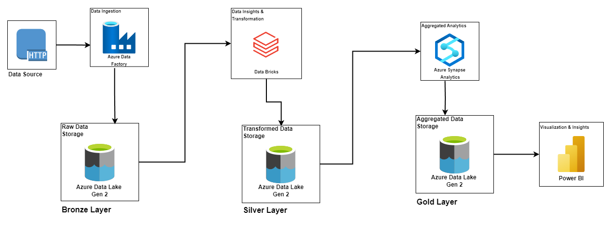

# Customer Retention Intelligence — Azure Data Engineering Pipeline

An end-to-end, cloud-native data pipeline on **Microsoft Azure** that ingests the AdventureWorks sales dataset (2015–2017), refines it through a **medallion (bronze → silver → gold) architecture**, and serves customer-retention, churn and sales analytics to a **Power BI** dashboard.

**[▶ View the live Power BI dashboard](https://app.powerbi.com/view?r=eyJrIjoiODM0MjU5MjktNzYyZC00YTdhLThjNmEtNTYzMzhkMmE4Y2NhIiwidCI6IjkxM2YxOGVjLTdmMjYtNGM1Zi1hODE2LTc4NGZlOWE1OGVkZCIsImMiOjh9)**


## Architecture


| Layer | Service | Format | What happens |
|---|---|---|---|
| **Bronze** | Azure Data Factory → ADLS Gen2 | CSV | A parameterised, metadata-driven pipeline (Lookup + ForEach + Copy) ingests every source file over HTTP |
| **Silver** | Azure Databricks (PySpark) → ADLS Gen2 | Parquet | Column standardisation, type casting, cleaning and enrichment |
| **Gold** | Azure Synapse serverless SQL → ADLS Gen2 | Parquet | Views over silver data and analytical tables materialised with **CETAS** |
| **Serving** | Power BI | — | KPIs, churn funnel, trends and drill-downs |

## Analytics in the gold layer
| Table | Business question |
|---|---|
| `vw_customer_retention` | Who are our customers, how much do they spend, and are they active or churned? |
| `vw_product_lifecycle` | Which products are new, trending or declining? |
| `vw_product_bundle_analysis` | Which products are frequently bought together? |
| `vw_sales_by_region` | How is revenue growing month over month in each region and country? |
| `vw_sales_anomalies` | Which months show unusual (±20%) revenue swings? |

Power BI KPIs (DAX in [`power-bi/dax-measures`](power-bi/dax-measures)): **churn rate**, **active / new / returning customers**, **total revenue**, with a year slicer for 2015–2017.

## Repository structure
```
├── bronze/ingestion_parameters.json   # Source URLs and sink folders for the ADF ForEach loop
├── silver/silver_layer_transformation.ipynb   # Databricks PySpark notebook
├── gold/                              # Synapse SQL, run in numeric order
│   ├── 00_create_schema.sql
│   ├── 01_config.sql                  # Master key, credential, external data sources, file format
│   ├── 02_views.sql                   # gold.* views over silver Parquet files
│   └── 03–07_*.sql                    # CETAS analytical tables
├── power-bi/
│   ├── customer_retention_dashboard.pbix
│   └── dax-measures/
└── docs/architecture.{png,drawio}
```

## Reproducing the pipeline
1. **Storage** — create an ADLS Gen2 account with `bronze`, `silver` and `gold` containers.
2. **Ingest** — in Data Factory, build a pipeline that looks up [`bronze/ingestion_parameters.json`](bronze/ingestion_parameters.json) and, for each entry, copies the CSV from the HTTP source into `bronze/<p_sink_folder>/<p_sink_file>`.
3. **Transform** — register a service principal with *Storage Blob Data Contributor* on the account, store its client ID, secret and tenant ID in a Databricks secret scope (`cri-key-vault`, backed by Azure Key Vault), then run [`silver/silver_layer_transformation.ipynb`](silver/silver_layer_transformation.ipynb).
4. **Serve** — in a Synapse workspace (serverless SQL pool) run the scripts in [`gold/`](gold) in order. Replace the master-key password placeholder in `01_config.sql` and the storage account name if yours differs. CETAS will not overwrite existing files, so clear the target folder in the `gold` container before re-running a script.
5. **Visualise** — open the `.pbix` file and point the data source at your Synapse serverless SQL endpoint.

## Possible improvements
- Parameterise the storage account name across ADF, Databricks and Synapse, and commit the ADF pipeline JSON (ARM/Bicep templates) for one-click deployment.
- Load silver tables as **Delta Lake** to get schema enforcement and incremental (MERGE) loads.
- Add data-quality checks (e.g. Great Expectations) between layers and schedule the pipeline with ADF triggers.

## Data
AdventureWorks sample data (Microsoft), sourced as CSV files from a public GitHub mirror.

## License
[MIT](LICENSE)
